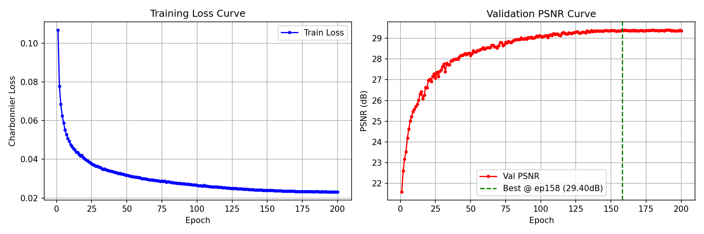
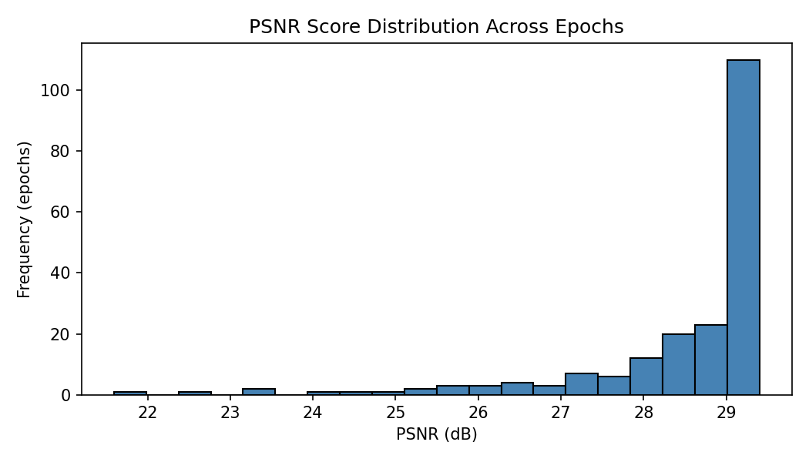
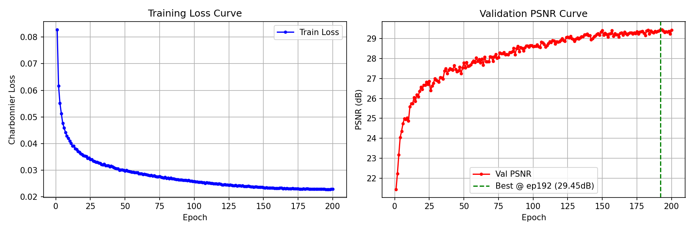
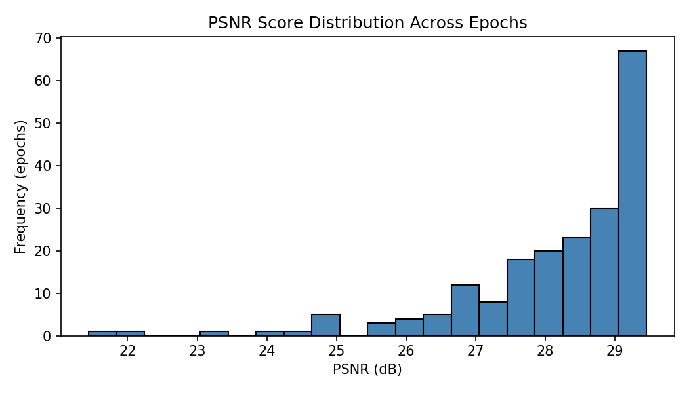

# NYCU Deep Vision 2026 HW4

- **Student ID**: Your Student ID
- **Name**: Your Name

---

## Introduction

This project implements an image restoration model based on **PromptIR** to remove rain and snow degradation from images. A single unified model is trained to handle both degradation types simultaneously.

Key contributions:
- PromptIR backbone with channel-wise self-attention (O(C²), resolution-free)
- Charbonnier loss with rain sample weighting (1.5×)
- Gradient accumulation to simulate larger batch sizes
- Mixed precision training (AMP) for memory efficiency
- Best validation PSNR: **29.40 dB**

---

## Environment Setup

```bash
pip install torch torchvision --index-url https://download.pytorch.org/whl/cu121
pip install numpy pillow matplotlib
```

**Requirements:**
- Python >= 3.8
- PyTorch >= 2.0
- CUDA >= 11.8 (recommended)

---

## Usage

### Dataset Structure

Place the dataset under `./hw4_realse_dataset/`:

```
hw4_realse_dataset/
├── train/
│   ├── degraded/    # rain-1000.png, snow-1000.png, ...
│   └── clean/       # rain_clean-1000.png, snow_clean-1000.png, ...
└── test/
    └── degraded/    # rain-1.png, snow-1.png, ... (no ground truth)
```

### Training

```bash
python train_infer.py --mode train \
    --data_root ./hw4_realse_dataset \
    --gpu 0 \
    --epochs 200 \
    --batch_size 4 \
    --patch_size 128 \
    --accum_steps 4 \
    --rain_weight 1.5
```

### Inference

```bash
python train_infer.py --mode infer \
    --data_root ./hw4_realse_dataset \
    --ckpt ./checkpoints_v3/best.pth \
    --gpu 0 \
    --output_dir ./output_v3
```

### Train then Infer (All-in-one)

```bash
python train_infer.py --mode all \
    --data_root ./hw4_realse_dataset \
    --gpu 0
```

**Output:** `./output_v3/pred.npz` — keys are filenames (e.g. `rain-1.png`), values are `(3, H, W)` uint8 numpy arrays.

### All Arguments

| Argument | Default | Description |
|---|---|---|
| `--mode` | `train` | `train` / `infer` / `all` |
| `--data_root` | `./hw4_realse_dataset` | Dataset root path |
| `--ckpt_dir` | `./checkpoints_v3` | Checkpoint save directory |
| `--ckpt` | `None` | Checkpoint path for inference |
| `--output_dir` | `./output_v3` | Output directory for pred.npz |
| `--dim` | `48` | Base channel dimension |
| `--epochs` | `100` | Number of training epochs |
| `--batch_size` | `8` | Batch size |
| `--patch_size` | `128` | Random crop size |
| `--lr` | `2e-4` | Learning rate |
| `--num_workers` | `4` | DataLoader workers |
| `--log_every` | `50` | Log interval (steps) |
| `--gpu` | `0` | GPU index |
| `--accum_steps` | `4` | Gradient accumulation steps |
| `--rain_weight` | `1.5` | Loss weight for rain samples |

---

## Results

### Training Curves — Main Model



*Training loss (left) and validation PSNR (right) for the main model. Best PSNR = 29.45 dB @ epoch 192.*



*PSNR score distribution across all epochs for the main model.*

### Training Curves — Baseline Model



*Training loss (left) and validation PSNR (right) for the baseline model. Best PSNR = 29.40 dB @ epoch 158.*



*PSNR score distribution across all epochs for the baseline model.*

---

## Performance Snapshot


| Model | Val PSNR | Best Epoch |
|---|---|---|
| PromptIR (dim=48, Charbonnier loss) | 29.40 dB | 158 / 200 |
